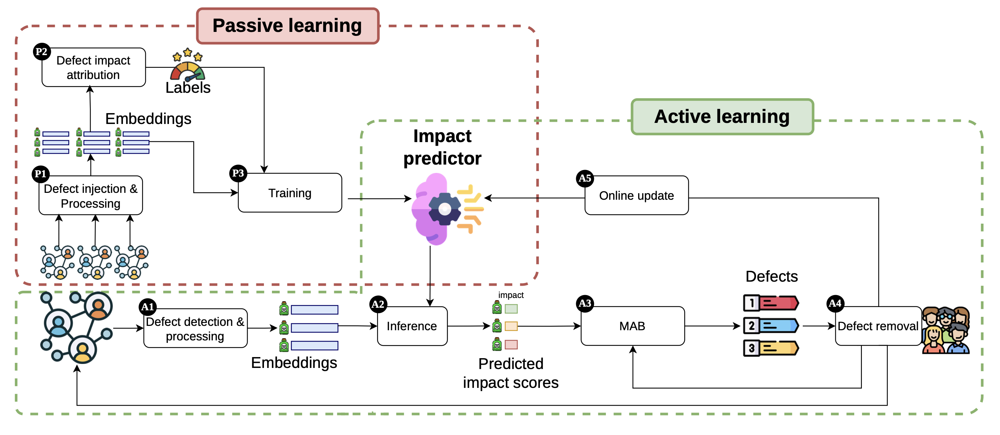

# SCRIBA

This repository contains the code for **SCRIBA: A Budget-Aware Active Learning Framework for Defect Removal in Recommender Systems**, presented as a full paper at the 2026 ACM CIKM conference.

## How SCRIBA works


The pipeline comprises two main phases: *passive learning* and *active learning* phases.

### Passive Learning

**Defect injection and processing**
The pipeline starts from a collection of user-item interaction graphs, into which synthetic defects are artificially injected — fake user profiles and fraudulent interactions — to simulate realistic attack scenarios. A GraphSAGE encoder is then trained on these corrupted graphs, learning to represent every node (user or item) in a shared latent space. Each defect is then represented as the average of the embeddings of its constituent nodes.

**Impact attribution**
To quantify how much each defect harms recommendation quality, a leave-one-out strategy is applied: one defect at a time is removed from the graph, the recommendation model (LightGCN) is lightly fine-tuned on the resulting graph, and the change in Shannon entropy of the recommendation lists for the affected users is measured. A positive shift means that removing that defect increases recommendation diversity.

**Predictor training**
The defect representations and their corresponding entropy variations are used to train a linear regressor, which learns to estimate the impact of a defect without actually removing it. This predictor can then be applied to previously unseen graphs.

**Detection and representation**
On a new deployment graph, an anomaly detection algorithm (FRAUDAR) identifies candidate defects. Each one is projected into the same latent space as the encoder trained in the passive phase, producing a compact and comparable representation.

## Active Learning
**Impact prediction and bandit-based selection**
The predictor estimates the expected impact of each candidate defect. Those with a predicted impact below a threshold are discarded. Among the remaining ones, a LinUCB contextual bandit selects which defects to remove within the available budget, balancing exploitation — favouring defects with high estimated impact — and exploration — considering defects in under-observed regions of the latent space.

**Human validation and removal**
The selected defects are submitted to human reviewers, who confirm which ones should actually be removed from the graph. After removal, the recommendation model is fine-tuned on the cleaned graph.

**Online update**
The feedback signals collected after each removal — the actual impact observed on the target user segment — are used to update both the predictor and the bandit, progressively improving the quality of future selections as the budget is consumed.

## Before Getting Started

1. Clone the progject.

2. Download the six datasets from the Amazon Reviews 2023 collection: [Amazon Reviews 2023 collection](https://amazon-reviews-2023.github.io/)

3. Extract the interaction `.jsonl` files into the following directory:

```text
src/data/original/
```

3. From the root directory of the project, run:

```bash
pip install -r requirements.txt
```

## Passive learning
1. To run the passive learning phases of the pipeline, from preprocessing to training of impact predictor, run:
   
```bash
python run src/passive_learning/main.py
```


## Active learning 
1. To run the active learning phases of the pipeline, run:
   
```bash
python run src/active_learning/main.py
```
